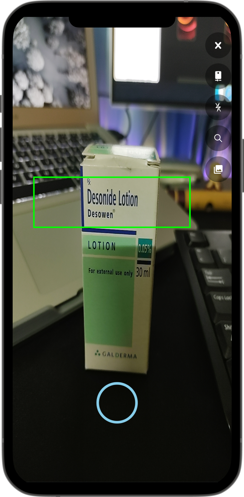

<!-- # TODO:

- [x] - Cropping works
- [x] - Add Cloudinary upload support
- [ ] - Work on the actual OCR in the Flask API
- [x] - How and where to store the original images. -->

# Aushadhalay 

   

Want your meds ? Just Whip out your phone and snap a photo of the packaging and boom it shows you all the meds matching your med's name in our database

Community : [Whatsapp Business](https://www.google.com)

Why Aushadhalay instead of other apps:

* Unlimited range of Medicinal Products 💊
* Intuitive 🐝 
* One Scan away from your meds 🕵🏼‍♀️ 🕵🏼‍♂️
   

   <!-- <!--  -->
    -->

   <!--  -->
